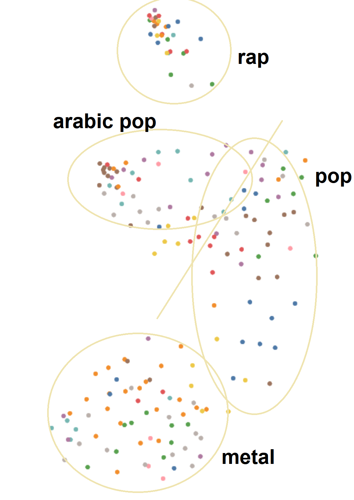

# Audio Embeddings Using VGGish
This repository contains the code to extract audio embeddings using VGGish model. The VGGish model is a variant of the VGG architecture that is trained to predict AudioSet embeddings. The model is trained on a large dataset of audio and is able to extract embeddings that can be used for audio classification, retrieval, and other audio-related tasks.

# Setup

Code below is for windows, adjust accordingly for other OS.

Download the VGGish model and PCA parameters for post-processing the embeddings:

```bash
curl -O https://storage.googleapis.com/audioset/vggish_model.ckpt
curl -O https://storage.googleapis.com/audioset/vggish_pca_params.npz
```

Clone the repository with the inference and modelling code:

```bash
git clone https://github.com/tensorflow/models.git
```

Now copy the content of the following directory to the working directory, and delete the repo you cloned (won't be needed anymore):
    
```bash
git clone https://github.com/tensorflow/models.git
copy models\research\audioset\vggish\* .
rmdir models /s
```

Create a virtual environment and install the required packages:

```bash
pip install virtualenv
virtualenv venv
venv/bin/activate
pip install -r requirements.txt
```

Ensure you have ``ffmpeg`` installed and added to the system path. If not, download it from [here](https://www.ffmpeg.org/download.html).

# Usage

The barebones code for extracting audio embeddings is in embed.py. The code below shows how to use the code to extract embeddings from an audio file:

NOTE: VGGish expects a wav, mono, at 16kHz, I've handled this very primitively in my code, but you might need to fix it.

In python:
```python
from embed import embed_audio
from glob import glob
from tqdm import tqdm

paths = glob('path\to\your\audio\files\*.mp3') # replace format with the format of your audio files

# embed_audio takes in three parameters, a path, a string of the pooling method ("mean", "sum"), and a boolean of whether to postprocess the embeddings (quantize and whiten)
# in my experiments, the postprocessing step performed very poorly and mean and sum pooling where very similar but I prefer mean pooling
embeddings = np.array([embed_audio(path, "mean", True) for path in tqdm(paths)])

# embeddings is a 2D array of shape (n, 128) where n is the number of audio files, embeddings are normalized after pooling
```

CLI (used mainly for testing, prints the embedding to the console):
```bash
python embed.py path\to\your\audio\file.mp3 mean True
```

# Demo
The following links to a Nomic Atlas map of the embeddings with the following params:
- Mean Pooling
- No Post Processing
- Normalized
- Metadata from the spotify API
- 30 sec preview clips of the songs
- mp3 resampled to 16kHz and mixed down to mono

[Audio Embeddings Map](https://atlas.nomic.ai/data/tyqnology/grad-playlist-vggish-mean-pooling-normalized/map)

Here is my primitive drawing over the map (it passed the sanity check it has clusters of reasonable meaning):



# References
- [VGGish Model Original Code](https://github.com/tensorflow/models/blob/master/research/audioset/vggish/README.md)
- [Colab Demo (good code, not by me)](https://colab.research.google.com/drive/1E3CaPAqCai9P9QhJ3WYPNCVmrJU4lAhF)